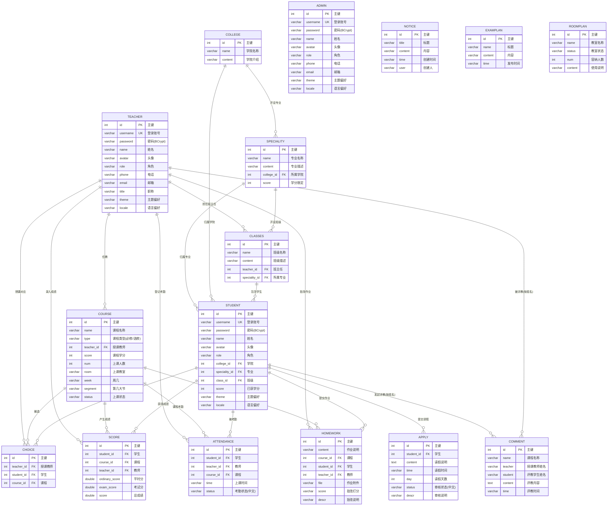

# 数据库 ER 图

> 数据库：`xm_educational_manager`（MySQL 5.7，共 21 张表）
> 说明：系统采用**逻辑外键**设计（不建物理外键约束，由应用层保证一致性，便于批量导入与维护），下图为逻辑关系。
> 图表使用 Mermaid 渲染，可在 GitHub 直接查看，也可粘贴到 [mermaid.live](https://mermaid.live) 导出 PNG/SVG 插入论文。

## 一、核心业务 ER 图（16 张业务表）

## 二、RBAC 权限与日志 ER 图（5 张系统表）

> 账号三表（`admin` / `teacher` / `student`）的 `role` 字段与 `sys_role.code` **逻辑关联**（值同为 `ADMIN` / `TEACHER` / `STUDENT`），
> 登录时按该值查询角色对应的权限点集合，实现 RBAC 动态鉴权。`ADMIN` 角色在服务端切面直接放行。

## 三、设计要点说明

1. **以「课程」为中心的星型结构**：`choice`（选课）、`score`（成绩）、`attendance`（考勤）、`homework`（作业）四张表
   都是「学生 × 课程 × 教师」的关联实体——选课是前提，成绩/考勤/作业都发生在"某学生选了某教师的某门课"上。
2. **评教表按姓名弱关联**：`comment` 表存的是师生姓名而非 ID（历史设计），与师生表为弱关联，图中已标注。
3. **逻辑外键而非物理外键**：不建 `FOREIGN KEY` 约束，配合 `uk_username` 唯一索引、
   `idx_student_course` 等二级索引保证查询性能（索引设计见种子建表语句）。
4. **三账号表结构相近但分表存储**：`admin` / `teacher` / `student` 字段高度相似，分表是因为三角色的
   业务字段差异（学生有班级归属与学分，教师有职称）与数据隔离需求（各角色独立管理页）。
5. **独立实体**：`notice`（教务通知）、`examplan`（考试安排）、`roomplan`（教室安排）、`admin`（管理员）
   无外键关联，为全员公告/独立账号类数据；通知发布时通过 WebSocket 全员广播。
