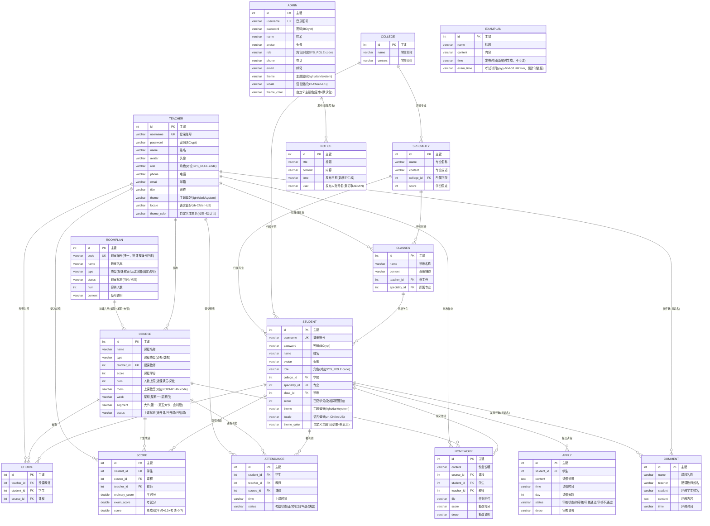
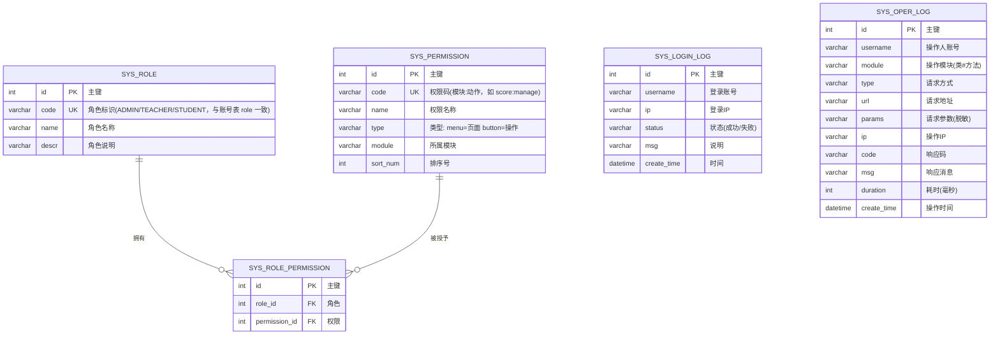

# 数据库 ER 图

> 数据库：`xm_educational_manager`（MySQL 5.7，共 21 张表；表结构以种子 `sql/xm_educational_manager-full.sql` 为准）
> 说明：系统采用**逻辑外键**设计（不建物理外键约束，由应用层保证一致性，便于批量导入与维护），下图为逻辑关系。
> 图表使用 Mermaid 渲染，可在 GitHub 直接查看，也可粘贴到 [mermaid.live](https://mermaid.live) 导出 PNG/SVG 插入论文。

## 一、核心业务 ER 图（16 张业务表）



## 二、RBAC 权限与日志 ER 图（5 张系统表）



> 账号三表（`admin` / `teacher` / `student`）的 `role` 字段与 `sys_role.code` **逻辑关联**（值同为 `ADMIN` / `TEACHER` / `STUDENT`），
> 登录时按该值查询角色对应的权限点集合，实现 RBAC 动态鉴权。`ADMIN` 角色在服务端切面直接放行。

## 三、设计要点说明

1. **以「课程」为中心的星型结构**：`choice`（选课）、`score`（成绩）、`attendance`（考勤）、`homework`（作业）四张表
   都是「学生 × 课程 × 教师」的关联实体——选课是前提，成绩/考勤/作业都发生在"某学生选了某教师的某门课"上。
2. **评教表按姓名弱关联**：`comment` 表存的是师生姓名而非 ID（历史设计），与师生表为弱关联，图中已标注。
3. **逻辑外键而非物理外键**：不建 `FOREIGN KEY` 约束，由业务层保证引用完整性，
   查询性能靠二级索引兜底（见下方「索引设计」，建表语句在种子文件中）。
4. **三账号表结构相近但分表存储**：`admin` / `teacher` / `student` 字段高度相似，分表是因为三角色的
   业务字段差异（学生有班级归属与学分，教师有职称）与数据隔离需求（各角色独立管理页）。
5. **公告类实体与弱关联**：`examplan`（考试安排）无外键关联，有两个时间字段——`time` 为发布时间
   （新增时由后端生成、不可修改），`exam_time` 为考试时间（`yyyy-MM-dd HH:mm`，Web 与小程序据此显示考试倒计时，
   升级前录入的旧数据可为空）；`notice`（教务通知）的 `user` 存发布人**账号名**（默认只有管理员有 `notice:manage` 权限），
   与 `admin` 表按账号名弱关联，通知发布时通过 WebSocket 全员广播。
6. **教室按「编号 + 时段」逻辑占用**：`course.room` 存教室编号（对应 `roomplan.code`，唯一）。
   `roomplan.type = 固定占用`（办公室、器材存放等）不参与排课；课程保存时校验同一
   「教室 + 星期 + 大节」不重叠（错误码 5010），状态为「已结课」的课程自动释放教室；
   排课表单只列该时段空闲教室，留空时系统按容量就近自动分配（体育课优先运动场馆）。
7. **计算型数据不落表**：学业预警（按成绩与考勤多指标加权实时算出风险指数）、课程推荐（基于选课矩阵的协同过滤）、
   我的课表（由选课 + 课程拼装，`Curriculum` 只是传输对象）都不单独建表；首页统计与数据大屏同样按需聚合。
8. **表结构演进**：新增列同时写进种子 SQL（新库）和后端启动迁移 `SchemaMigration`（查 `information_schema`，
   旧库缺列才执行 `ALTER`，幂等），已在用的数据库不必重新导入；目前由它补齐的列是 `examplan.exam_time`。

## 四、索引设计

除主键外，按「数据隔离」与「精确查找」两类实际查询模式建立二级索引。

| 表 | 索引 | 类型 | 服务的查询 |
| --- | --- | --- | --- |
| `choice` | `idx_choice_student` / `idx_choice_course` / `idx_choice_teacher` | 单列 | 按角色隔离选课数据；按课程统计已选人数（选课满员校验） |
| `score` | `idx_score_course_student` | **联合 (course_id, student_id)** | 「某学生某门课是否已录成绩」的精确查找；最左前缀同时服务按课程过滤 |
| `score` | `idx_score_student` / `idx_score_teacher` | 单列 | 学生查自己的成绩、教师查本人任课成绩 |
| `attendance` | `idx_att_student_course` | **联合 (student_id, course_id)** | 「同一学生同一课程同一天只能一条考勤」的重复录入校验 |
| `attendance` | `idx_att_course` / `idx_att_teacher` | 单列 | 按课程/教师维度的考勤查询 |
| `homework` | `idx_hw_student` / `idx_hw_course` / `idx_hw_teacher` | 单列 | 作业列表的角色隔离 |
| `admin` / `teacher` / `student` | `uk_*_username` | **UNIQUE** | 登录时按用户名查账号；同时从数据库层保证账号不重复 |
| `course` | `idx_room_week_segment` | 联合 | 教室占用校验与智能排课分配 |
| `roomplan` | `uk_room_code` | UNIQUE | 教室编号唯一 |
| `sys_login_log` / `sys_oper_log` | `idx_create_time` / `idx_username` | 单列 | 日志分页查询与按时间定期清理 |
| `sys_permission` / `sys_role` / `sys_role_permission` | `uk_permission_code` / `idx_permission_module` / `uk_role_code` / `uk_role_permission` / `idx_rp_permission` | UNIQUE + 单列 | 权限码与角色码唯一；权限设置页按模块分组列出权限点；角色-权限关联查询 |

### 设计说明

1. **联合索引的列顺序按选择性与前缀复用决定**。`score(course_id, student_id)` 把 `course_id` 放在前面，
   使该索引既服务「课程 + 学生」的精确查找，也能被「仅按课程过滤」的查询复用（最左前缀原则），
   省去一个单列索引。`attendance(student_id, course_id)` 同理。
2. **`username` 用 UNIQUE 而非普通索引**。除了加速登录查询，更重要的是把「账号不重复」这个约束
   下沉到数据库：业务层的「先查询是否存在、再插入」在并发下存在竞态窗口，唯一约束是最后一道防线。
3. **日志表索引按访问模式建**。`create_time` 服务分页排序与「清理 90 天前日志」的定时任务，
   `username` 服务按操作人筛选。

### 实测执行计划

```
score WHERE teacher_id=?                     -> type=ref,   key=idx_score_teacher
score WHERE course_id=? AND student_id=?     -> type=ref,   key=idx_score_course_student
student WHERE username=?                     -> type=const, key=uk_student_username
apply WHERE status=?（该列无索引，对照组）    -> type=ALL,   全表扫描
```

对照组说明了差异：同样的数据量下，有索引的列走 `ref` / `const`，无索引的列退化为 `ALL` 全表扫描。
复现方式：`EXPLAIN SELECT * FROM score WHERE teacher_id=2\G`
