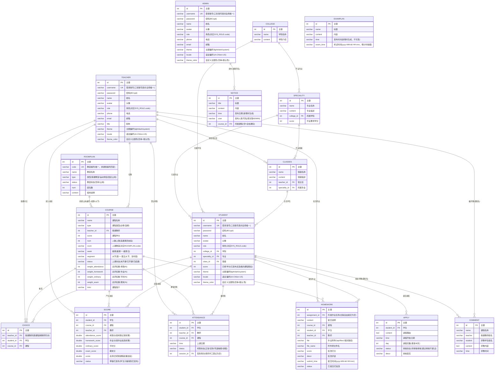
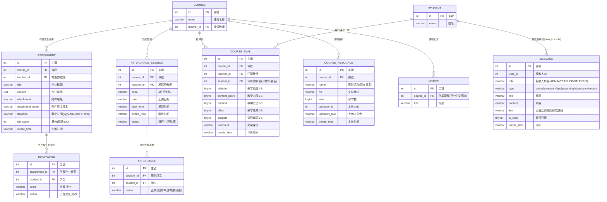
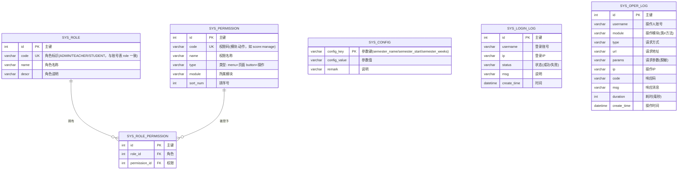

# 数据库 ER 图

> 数据库：`xm_educational_manager_v2`（MySQL 5.7，共 27 张表；表结构以种子 `sql/xm_educational_manager-full.sql` 为准）
> 说明：系统采用**逻辑外键**设计（不建物理外键约束，由应用层保证一致性，便于批量导入与维护），下图为逻辑关系。
> 图表使用 Mermaid 渲染，可在 GitHub 直接查看，也可粘贴到 [mermaid.live](https://mermaid.live) 导出 PNG/SVG 插入论文。

## 一、核心业务 ER 图（档案、课程、选课与成绩，16 张表）


```mermaid
erDiagram
    COLLEGE {
        int id PK "主键"
        varchar name "学院名称"
        varchar content "学院介绍"
    }
    SPECIALITY {
        int id PK "主键"
        varchar name "专业名称"
        varchar content "专业描述"
        int college_id FK "所属学院"
        int score "毕业要求学分"
    }
    CLASSES {
        int id PK "主键"
        varchar name "班级名称"
        varchar content "班级描述"
        int teacher_id FK "班主任"
        int speciality_id FK "所属专业"
    }
    STUDENT {
        int id PK "主键"
        varchar username UK "登录账号(三张账号表间全局唯一)"
        varchar password "密码(BCrypt)"
        varchar name "姓名"
        varchar avatar "头像"
        varchar role "角色(对应SYS_ROLE.code)"
        int college_id FK "学院"
        int speciality_id FK "专业"
        int class_id FK "班级"
        int score "已修学分(已发布且及格的课程累加)"
        varchar theme "主题偏好(light/dark/system)"
        varchar locale "语言偏好(zh-CN/en-US)"
        varchar theme_color "自定义主题色(空串=默认色)"
    }
    TEACHER {
        int id PK "主键"
        varchar username UK "登录账号(三张账号表间全局唯一)"
        varchar password "密码(BCrypt)"
        varchar name "姓名"
        varchar avatar "头像"
        varchar role "角色(对应SYS_ROLE.code)"
        varchar phone "电话"
        varchar email "邮箱"
        varchar title "职称"
        varchar theme "主题偏好(light/dark/system)"
        varchar locale "语言偏好(zh-CN/en-US)"
        varchar theme_color "自定义主题色(空串=默认色)"
    }
    ADMIN {
        int id PK "主键"
        varchar username UK "登录账号(三张账号表间全局唯一)"
        varchar password "密码(BCrypt)"
        varchar name "姓名"
        varchar avatar "头像"
        varchar role "角色(对应SYS_ROLE.code)"
        varchar phone "电话"
        varchar email "邮箱"
        varchar theme "主题偏好(light/dark/system)"
        varchar locale "语言偏好(zh-CN/en-US)"
        varchar theme_color "自定义主题色(空串=默认色)"
    }
    COURSE {
        int id PK "主键"
        varchar name "课程名称"
        varchar type "课程类型(必修/选修)"
        int teacher_id FK "授课教师"
        int score "课程学分"
        int num "人数上限(选课满员校验)"
        varchar room "上课教室(对应ROOMPLAN.code)"
        varchar week "星期(星期一~星期日)"
        varchar segment "大节(第一~第五大节，含时段)"
        varchar status "上课状态(未开课/已开课/已结课)"
        int weight_attendance "总评权重:考勤(%)"
        int weight_homework "总评权重:作业(%)"
        int weight_ordinary "总评权重:平时(%)"
        int weight_exam "总评权重:期末(%)"
        varchar intro "课程简介"
    }
    CHOICE {
        int id PK "主键"
        int teacher_id FK "授课教师(随课程换教师同步)"
        int student_id FK "学生"
        int course_id FK "课程"
    }
    SCORE {
        int id PK "主键"
        int student_id FK "学生"
        int course_id FK "课程"
        int teacher_id FK "教师"
        double attendance_score "考勤分(按考勤记录折算)"
        double homework_score "作业分(按作业批改折算)"
        double ordinary_score "平时分"
        double exam_score "期末分"
        double score "总评(四项按课程权重加权)"
        varchar status "草稿/已发布(学生只看得到已发布)"
    }
    ATTENDANCE {
        int id PK "主键"
        int student_id FK "学生"
        int teacher_id FK "教师"
        int course_id FK "课程"
        varchar time "上课日期"
        varchar status "考勤状态(正常/迟到/早退/缺勤/请假)"
        int session_id FK "签到场次(老师手工登记为空)"
    }
    HOMEWORK {
        int id PK "主键"
        int assignment_id FK "所属作业任务(旧版自由提交为空)"
        varchar content "提交说明"
        int course_id FK "课程"
        int student_id FK "学生"
        int teacher_id FK "教师"
        varchar file "作业附件(/api/files/ 相对路径)"
        varchar file_name "附件原文件名"
        varchar score "批改打分"
        varchar descr "批改评语"
        varchar submit_time "提交时间(yyyy-MM-dd HH:mm)"
        varchar status "已提交/已批改"
    }
    APPLY {
        int id PK "主键"
        int student_id FK "学生"
        text content "请假理由"
        varchar time "请假开始日期"
        int day "请假天数(最多30天)"
        varchar status "审核状态(待审核/审核通过/审核不通过)"
        varchar descr "审核意见"
    }
    COMMENT {
        int id PK "主键"
        varchar name "课程名称"
        varchar teacher "授课教师姓名"
        varchar student "评教学生姓名"
        text content "评教内容"
        varchar time "评教时间"
    }
    NOTICE {
        int id PK "主键"
        varchar title "标题"
        varchar content "内容"
        varchar time "发布日期(新增时生成)"
        varchar user "发布人账号名(弱关联ADMIN)"
        int course_id FK "所属课程(空=全校通知)"
    }
    EXAMPLAN {
        int id PK "主键"
        varchar name "标题"
        varchar content "内容"
        varchar time "发布时间(新增时生成，不可改)"
        varchar exam_time "考试时间(yyyy-MM-dd HH:mm，倒计时依据)"
    }
    ROOMPLAN {
        int id PK "主键"
        varchar code UK "教室编号(唯一，排课按编号匹配)"
        varchar name "教室名称"
        varchar type "类型(授课教室/运动场馆/固定占用)"
        varchar status "教室状态(空闲/占用)"
        int num "座位数"
        varchar content "使用说明"
    }

    COLLEGE ||--o{ SPECIALITY : "开设专业"
    SPECIALITY ||--o{ CLASSES : "开设班级"
    CLASSES ||--o{ STUDENT : "包含学生"
    COLLEGE ||--o{ STUDENT : "归属学院"
    SPECIALITY ||--o{ STUDENT : "归属专业"
    TEACHER ||--o{ CLASSES : "担任班主任"
    TEACHER ||--o{ COURSE : "任教"
    STUDENT ||--o{ CHOICE : "选课"
    COURSE ||--o{ CHOICE : "被选"
    TEACHER ||--o{ CHOICE : "授课对应"
    STUDENT ||--o{ SCORE : "获得成绩"
    COURSE ||--o{ SCORE : "产生成绩"
    TEACHER ||--o{ SCORE : "录入成绩"
    STUDENT ||--o{ ATTENDANCE : "被考勤"
    COURSE ||--o{ ATTENDANCE : "课程考勤"
    TEACHER ||--o{ ATTENDANCE : "登记考勤"
    STUDENT ||--o{ HOMEWORK : "提交作业"
    COURSE ||--o{ HOMEWORK : "布置作业"
    TEACHER ||--o{ HOMEWORK : "批改作业"
    STUDENT ||--o{ APPLY : "提交请假"
    TEACHER ||--o{ COMMENT : "被评教(按姓名)"
    STUDENT ||--o{ COMMENT : "发起评教(按姓名)"
    ADMIN ||--o{ NOTICE : "发布(按账号名)"
    ROOMPLAN ||--o{ COURSE : "排课占用(编号+星期+大节)"
```

## 二、课程空间 ER 图（改版新增 5 张表）

每门课一个「课程空间」：签到、作业、成绩册、评价、资料、成员与公告都挂在课程上；站内消息把这些动作通知到人。


```mermaid
erDiagram
    COURSE {
        int id PK "主键"
        varchar name "课程名称"
        int teacher_id FK "授课教师"
    }
    ASSIGNMENT {
        int id PK "主键"
        int course_id FK "课程"
        int teacher_id FK "布置的教师"
        varchar title "作业标题"
        text content "作业要求"
        varchar attachment "附件地址"
        varchar attachment_name "附件原文件名"
        varchar deadline "截止时间(yyyy-MM-dd HH:mm)"
        int full_score "满分(默认100)"
        varchar create_time "布置时间"
    }
    HOMEWORK {
        int id PK "主键"
        int assignment_id FK "所属作业任务"
        int student_id FK "学生"
        varchar score "批改打分"
        varchar status "已提交/已批改"
    }
    ATTENDANCE_SESSION {
        int id PK "主键"
        int course_id FK "课程"
        int teacher_id FK "发起的教师"
        varchar code "4位签到码"
        varchar date "上课日期"
        varchar start_time "发起时间"
        varchar expire_time "截止时间"
        varchar status "进行中/已结束"
    }
    ATTENDANCE {
        int id PK "主键"
        int session_id FK "签到场次"
        int student_id FK "学生"
        varchar status "正常/迟到/早退/缺勤/请假"
    }
    COURSE_EVAL {
        int id PK "主键"
        int course_id FK "课程"
        int teacher_id FK "任课教师"
        int student_id FK "评价的学生(对教师匿名)"
        tinyint attitude "教学态度1-5"
        tinyint content_score "教学内容1-5"
        tinyint method "教学方法1-5"
        tinyint effect "教学效果1-5"
        tinyint support "课后辅导1-5"
        varchar comment "文字评价"
        varchar create_time "评价时间"
    }
    COURSE_RESOURCE {
        int id PK "主键"
        int course_id FK "课程"
        varchar name "资料名称(原文件名)"
        varchar file "文件地址"
        bigint size "字节数"
        int uploader_id "上传人ID"
        varchar uploader_role "上传人角色"
        varchar create_time "上传时间"
    }
    NOTICE {
        int id PK "主键"
        int course_id FK "所属课程(空=全校通知)"
        varchar title "标题"
    }
    MESSAGE {
        int id PK "主键"
        int user_id "接收人ID"
        varchar role "接收人角色(ADMIN/TEACHER/STUDENT)"
        varchar type "score/homework/apply/warning/attendance/course"
        varchar title "标题"
        varchar content "内容"
        varchar link "点击后跳转的前端路径"
        tinyint is_read "是否已读"
        varchar create_time "时间"
    }
    STUDENT {
        int id PK "主键"
        varchar name "姓名"
    }

    COURSE ||--o{ ASSIGNMENT : "布置作业任务"
    ASSIGNMENT ||--o{ HOMEWORK : "学生按任务提交"
    COURSE ||--o{ ATTENDANCE_SESSION : "发起签到"
    ATTENDANCE_SESSION ||--o{ ATTENDANCE : "签到生成考勤"
    COURSE ||--o{ COURSE_EVAL : "被评价"
    STUDENT ||--o{ COURSE_EVAL : "每门课评一次"
    COURSE ||--o{ COURSE_RESOURCE : "课程资料"
    COURSE ||--o{ NOTICE : "课程公告"
    STUDENT ||--o{ MESSAGE : "接收消息(按 user_id + role)"
```

## 三、RBAC 权限、系统参数与日志 ER 图（6 张系统表）


```mermaid
erDiagram
    SYS_ROLE {
        int id PK "主键"
        varchar code UK "角色标识(ADMIN/TEACHER/STUDENT，与账号表 role 一致)"
        varchar name "角色名称"
        varchar descr "角色说明"
    }
    SYS_PERMISSION {
        int id PK "主键"
        varchar code UK "权限码(模块:动作，如 score:manage)"
        varchar name "权限名称"
        varchar type "类型: menu=页面 button=操作"
        varchar module "所属模块"
        int sort_num "排序号"
    }
    SYS_ROLE_PERMISSION {
        int id PK "主键"
        int role_id FK "角色"
        int permission_id FK "权限"
    }
    SYS_CONFIG {
        varchar config_key PK "参数键(semester_name/semester_start/semester_weeks)"
        varchar config_value "参数值"
        varchar remark "说明"
    }
    SYS_LOGIN_LOG {
        int id PK "主键"
        varchar username "登录账号"
        varchar ip "登录IP"
        varchar status "状态(成功/失败)"
        varchar msg "说明"
        datetime create_time "时间"
    }
    SYS_OPER_LOG {
        int id PK "主键"
        varchar username "操作人账号"
        varchar module "操作模块(类#方法)"
        varchar type "请求方式"
        varchar url "请求地址"
        varchar params "请求参数(脱敏)"
        varchar ip "操作IP"
        varchar code "响应码"
        varchar msg "响应消息"
        int duration "耗时(毫秒)"
        datetime create_time "操作时间"
    }

    SYS_ROLE ||--o{ SYS_ROLE_PERMISSION : "拥有"
    SYS_PERMISSION ||--o{ SYS_ROLE_PERMISSION : "被授予"
```

> 账号三表（`admin` / `teacher` / `student`）的 `role` 字段与 `sys_role.code` **逻辑关联**（值同为 `ADMIN` / `TEACHER` / `STUDENT`），
> 登录时按该值查询角色对应的权限点集合，实现 RBAC 动态鉴权。`ADMIN` 角色在服务端切面直接放行。
> `sys_config` 存当前学期（名称、开学日期、教学周数），首页的「第几周」、日程的教学周都按它推算，在【教务后台 → 学期设置】里修改。

## 四、设计要点说明

1. **以「课程」为中心的星型结构**：`choice`（选课）、`score`（成绩）、`attendance`（考勤）、`homework`（作业）四张表
   都是「学生 × 课程 × 教师」的关联实体——选课是前提，成绩/考勤/作业都发生在"某学生选了某教师的某门课"上。
   改版后课程空间的签到场次、作业任务、课程评价、课程资料、课程公告也都挂在课程上。
2. **成绩册：四项加权 + 草稿/发布**：总评 = 考勤分、作业分、平时分、期末分按课程上的四项权重（合计 100）加权；
   考勤分、作业分由记录自动折算，老师只录平时分和期末分。成绩先存为「草稿」，发布后学生才看得到；
   学生的已修学分只累加「已发布且及格」的课程，撤回发布会把学分扣回。
3. **评教表按姓名弱关联**：旧版 `comment` 表存的是师生姓名而非 ID（历史设计），与师生表为弱关联；
   改版后的课程评价 `course_eval` 按 ID 关联，同一学生对同一门课只能评一次（唯一索引兜底）。
4. **逻辑外键而非物理外键**：不建 `FOREIGN KEY` 约束，由业务层保证引用完整性：删除学院、专业、班级前检查下面还有没有
   专业、班级或学生（5029），有人选的课程（5030）、还有课或带班的老师（5031）、还有选课的学生（5032）、
   还排着没结课课程的教室（5034）都不能删；课程换任课教师时同步 `choice.teacher_id`，教室改编号时同步 `course.room`。
   查询性能靠二级索引兜底（见下方「索引设计」）。
5. **三账号表结构相近但分表存储**：`admin` / `teacher` / `student` 字段高度相似，分表是因为三角色的
   业务字段差异（学生有班级归属与学分，教师有职称）与数据隔离需求；登录页不选身份，所以账号名在三张表之间全局唯一。
6. **公告类实体与弱关联**：`examplan`（考试安排）无外键关联，有两个时间字段——`time` 为发布时间
   （新增时由后端生成、不可修改），`exam_time` 为考试时间（`yyyy-MM-dd HH:mm`，Web 与小程序据此显示考试倒计时）；
   `notice` 的 `course_id` 为空是全校通知、不为空是课程公告；`user` 存发布人**账号名**，与 `admin` 表按账号名弱关联。
7. **教室按「编号 + 时段」逻辑占用**：`course.room` 存教室编号（对应 `roomplan.code`，唯一）。
   `roomplan.type = 固定占用`（办公室、器材存放等）不参与排课；课程保存时校验同一
   「教室 + 星期 + 大节」不重叠（错误码 5010），状态为「已结课」的课程不占教室，重新开课时会再查一次占用；
   开课向导只列该时段空着、坐得下的教室，体育课优先运动场馆。
8. **计算型数据不落表**：学业预警（按成绩与考勤多指标加权实时算出风险指数）、课程推荐（基于选课矩阵的协同过滤）、
   课表与日程（由选课 + 课程 + 学期参数拼装）、学生成绩单（已发布成绩 + 学分绩点汇总）都不单独建表。
9. **站内消息按「人 + 角色」投递**：`message` 用 `user_id + role` 定位接收人（三张账号表的 ID 会重复），
   成绩发布、作业批改、请假审核、学业预警等动作在事务提交后写入并经 WebSocket 实时推送，`link` 指向对应页面。
10. **表结构演进**：新增表、列同时写进种子 SQL（新库）和后端启动迁移 `SchemaMigration`（查 `information_schema`，
    旧库缺表、缺列才执行，幂等），已在用的数据库不必重新导入；改版新增的 6 张表、14 个列和课程空间的权限点都由它补齐。

## 五、索引设计

除主键外，按「数据隔离」与「精确查找」两类实际查询模式建立二级索引。

| 表 | 索引 | 类型 | 服务的查询 |
| --- | --- | --- | --- |
| `choice` | `idx_choice_student` / `idx_choice_course` / `idx_choice_teacher` | 单列 | 按角色隔离选课数据；按课程统计已选人数（选课满员校验） |
| `score` | `idx_score_course_student` | **联合 (course_id, student_id)** | 「某学生某门课是否已录成绩」的精确查找；最左前缀同时服务成绩册按课程取全部行 |
| `score` | `idx_score_student` / `idx_score_teacher` | 单列 | 学生成绩单、教师查本人任课成绩 |
| `attendance` | `idx_att_student_course` | **联合 (student_id, course_id)** | 「同一学生同一课程同一天只能一条考勤」的重复录入校验 |
| `attendance` | `idx_att_course` / `idx_att_teacher` | 单列 | 按课程/教师维度的考勤查询 |
| `attendance_session` | `idx_session_course` | 联合 (course_id, status) | 找某门课进行中的签到场次 |
| `homework` | `idx_hw_student` / `idx_hw_course` / `idx_hw_teacher` / `idx_homework_assignment` | 单列 | 作业列表的角色隔离；某个作业任务的全部提交 |
| `assignment` / `course_resource` | `idx_assignment_course` / `idx_resource_course` | 单列 | 课程空间按课程列出作业任务、资料 |
| `course_eval` | `uk_eval_course_student` | **UNIQUE (course_id, student_id)** | 每名学生对每门课只能评价一次 |
| `course_eval` | `idx_eval_teacher` | 单列 | 教师看自己课程的评价汇总 |
| `notice` | `idx_notice_course` | 单列 | 课程公告与全校通知分开查询 |
| `message` | `idx_message_receiver` | 联合 (user_id, role, is_read) | 消息中心列表与顶栏未读数 |
| `admin` / `teacher` / `student` | `uk_*_username` | **UNIQUE** | 登录时按用户名查账号；同时从数据库层保证账号不重复 |
| `course` | `idx_room_week_segment` | 联合 | 教室占用校验与空闲教室查询 |
| `roomplan` | `uk_room_code` | UNIQUE | 教室编号唯一 |
| `sys_login_log` / `sys_oper_log` | `idx_create_time` / `idx_username` | 单列 | 日志分页查询与按时间定期清理 |
| `sys_permission` / `sys_role` / `sys_role_permission` | `uk_permission_code` / `idx_permission_module` / `uk_role_code` / `uk_role_permission` / `idx_rp_permission` | UNIQUE + 单列 | 权限码与角色码唯一；权限设置页按模块分组列出权限点；角色-权限关联查询 |

### 设计说明

1. **联合索引的列顺序按选择性与前缀复用决定**。`score(course_id, student_id)` 把 `course_id` 放在前面，
   使该索引既服务「课程 + 学生」的精确查找，也能被「仅按课程过滤」的查询复用（最左前缀原则），
   省去一个单列索引。`attendance(student_id, course_id)` 同理。
2. **`username` 用 UNIQUE 而非普通索引**。除了加速登录查询，更重要的是把「账号不重复」这个约束
   下沉到数据库：业务层的「先查询是否存在、再插入」在并发下存在竞态窗口，唯一约束是最后一道防线。
   `course_eval(course_id, student_id)` 的唯一索引出于同样的考虑。
3. **日志表索引按访问模式建**。`create_time` 服务分页排序与「清理 90 天前日志」的定时任务，
   `username` 服务按操作人筛选。

### 实测执行计划

```
score WHERE teacher_id=?                     -> type=ref,   key=idx_score_teacher
score WHERE course_id=? AND student_id=?     -> type=ref,   key=idx_score_course_student
student WHERE username=?                     -> type=const, key=uk_student_username
apply WHERE status=?（该列无索引，对照组）    -> type=ALL,   全表扫描
```

对照组说明了差异：同样的数据量下，有索引的列走 `ref` / `const`，无索引的列退化为 `ALL` 全表扫描。
复现方式：`EXPLAIN SELECT * FROM score WHERE teacher_id=2\G`
